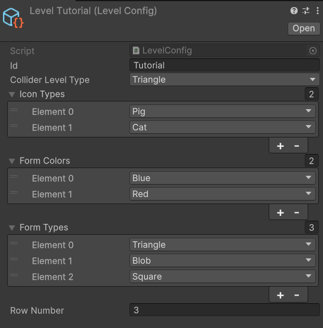

# TripleTest

Проект тестового задания по поиску одинаковых фигур.

## Описание

Игра заключается в том, чтобы находить в общей куче одинаковые фигурки, выдаваемые в начале уровня. Выбранные фигурки отправляются в слоты верхней панели. Если все слоты заполнены, но ни одной пары одинаковых фигур не собрано — вы проигрываете.  
При каждом удачном совпадении (все три одинаковые фигурки заняли слоты) эти слоты очищаются. Победа наступает при полной зачистке поля. После этого предлагается перейти на следующий уровень.

## Демонстрация
`

## Основные фичи

- **Конфигурация уровней** (ScriptableObject)  
  Задают, какие формы, цвета и иконки могут появиться на уровне, а также границы поля (коллайдеры).  
  - `LevelHolder` хранит последовательность конфигов.  
  - `LevelManager` переключает их по мере прохождения.  
  - Метод `GetAllCombinations()` генерирует все возможные комбинации фигур для спауна.
  

- **FigureSpawner**  
  Пул объектов для спауна и переиспользования фигурок: после удаления фигуры она деактивируется и возвращается в пул. Возвращает текущее количество активных фигур на сцене.  

- **GameStateMachine**  
  Управляет состояниями игры через Dependency Injection и UniRx:  
  1. `StartSessionState` — заполнение игрового поля  
  2. `SelectionState` — выбор фигур игроком  
  3. `WinState` и `FailState` — победа или поражение  
  Отслеживает количество фигур на поле и в слотах, включает/выключает физику и интерактивность.

- **IconsHolder** и **FormsHolder** (ScriptableObject)  
  Быстрый доступ к спрайтам и формам по запросу конфигуратора.

- **SlotsManager**  
  Управляет слотами верхней панели: добавляет фигурки, очищает при совпадении и сортирует после каждой вставки. Возвращает количество занятых слотов.

- **FigureView**  
  Описывает поведение фигурки на поле и в полёте.

- **ResultSlot**  
  Принимает фигурку в слот и отвечает за анимацию её перелёта.

## Используемые фреймворки и технологии

- **Zenject** — контейнер для Dependency Injection  
- **UniRx** — реактивное программирование (Observer pattern)  
- **UniTask** — асинхронные операции  
- **DoTween** — анимация движения фигурок
