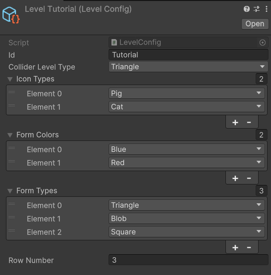

# TripleTest

Test assignment project for matching identical shapes.

## Description

The game challenges the player to find identical shapes from a common pool dealt at the start of each level. Selected shapes are sent to the slots in the top panel. If all slots become filled without forming at least one match of identical shapes, the player loses.  
Whenever a successful match occurs (all three identical shapes occupy the slots), those slots are cleared. Victory is achieved by completely clearing the field, after which the player can advance to the next level.

## Demo

 

  [Download the APK](https://drive.google.com/file/d/1kz10V4va_Vb0H0Yarv-FfscoKya4fb6h/view?usp=sharing)

## Key Features

- **Level Configuration** (ScriptableObject)  
  Defines which shapes, colors, and icons can appear on each level, as well as the field boundaries (colliders).  
  - `LevelHolder` stores the sequence of level configs.  
  - `LevelManager` advances through configs as the player progresses.  
  - `GetAllCombinations()` generates all possible shape combinations for spawning.  
  

- **FigureSpawner**  
  An object pool for spawning and reusing shapes: when a shape is removed, it’s deactivated and returned to the pool. Provides the current count of active shapes in the scene.

- **GameStateMachine**  
  Manages game flow using Dependency Injection and UniRx:  
  1. `StartSessionState` — populates the game field  
  2. `SelectionState` — player selects shapes  
  3. `WinState` and `FailState` — handle victory or defeat  
  Tracks the number of shapes on the field and in slots, and toggles physics and interactivity.

- **IconsHolder** & **FormsHolder** (ScriptableObject)  
  Provides quick access to sprites and shape meshes on demand.

- **SlotsManager**  
  Manages the top-panel slots: adds shapes, clears matched slots, and sorts slots after each insertion. Returns the number of occupied slots.

- **FigureView**  
  Controls shape behavior both on the field and during flight.

- **ResultSlot**  
  Receives a shape into a slot and handles its flight animation.

## Frameworks & Technologies

- **Zenject** — Dependency Injection container  
- **UniRx** — Reactive programming (Observer pattern)  
- **UniTask** — Asynchronous operations  
- **DoTween** — Tweening animations
